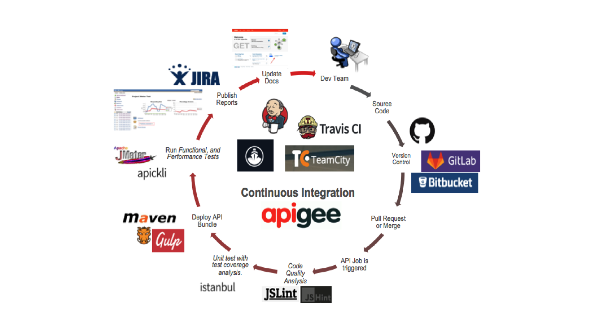

# Continuous Integration for Apigee Proxies using Maven

The objective of this project is to implement a containarised framework that can
be used to demonstrate best practices around continuous integration for Apigee
projects.

## Components

### Sample Apigee Proxy - Currency API

Project contains a sample proxy for a currency API that retrieves exchange rates
for a base currency using [fixer.io](http://fixer.io) API as the target.

See [Currency API OpenAPI Specification](./docs/currency-v1.yaml) for more
information on northbound api design.

The following best practices demonstrated:

*   Error handling - [Community
    Article](https://community.apigee.com/content/kbentry/23724/an-error-handling-pattern-for-apigee-proxies.html)

*   Deployment suffix for team deployment - [Community
    Article](https://community.apigee.com/content/kbentry/26716/api-proxy-team-development-with-maven.html)

*   Commit data in proxy description. See [pom](./currency-v1/pom.xml#L171).

*   Unit testing - [Community
    Article](https://community.apigee.com/articles/3964/unit-testing-javascript-code-with-mocha-sinon-and.html).

*   Integration testing with BDD and apickli - see [feature
    file](./currency-v1/test/integration/features/rates.feature).

See [maven phases](./docs/maven-phases.md) document to understand pom structure.

### Dockerfile

Project contains a [Dockerfile](./docker/Dockerfile) that can be used to create
a Jenkins image ready to start deploying currency api.

Docker implementation performs the following operations:

*   Jenkins plugin installation - check out the [list of plugins
    installed](./docker/jenkins/plugins)

*   Setup build jobs - see [jobs folder](./docker/jenkins/jobs)

*   Configure maven settings

*   Configure ssh for github authentication

*   Install node.js and npm

Read the [Jenkins build pipeline](./docs/jenkins-pipeline.md) to understand how
pipeline is configured for this demonstration.

Read the [setup instructions](./docs/setup.md) for step-by-step instructions on
how to setup the whole CI process using the sample proxy and Dockerfile.